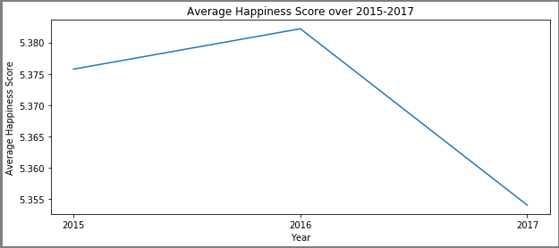
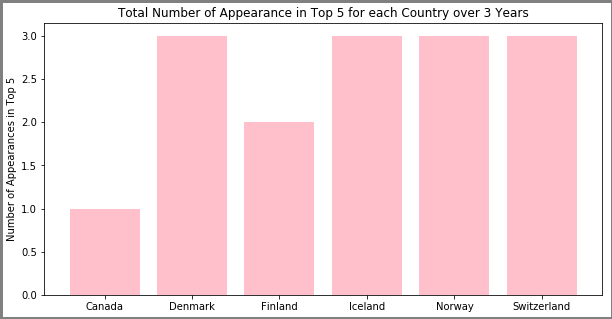
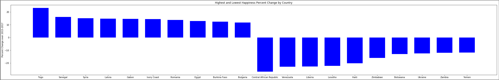
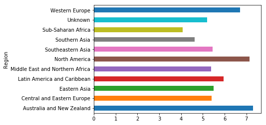
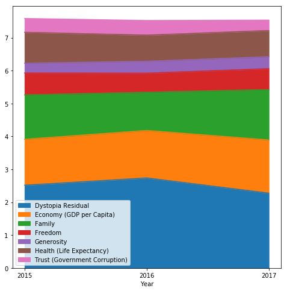
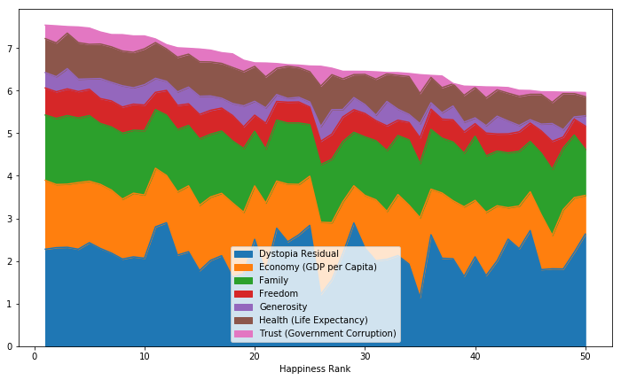
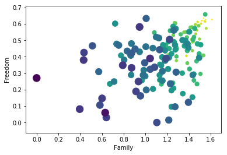
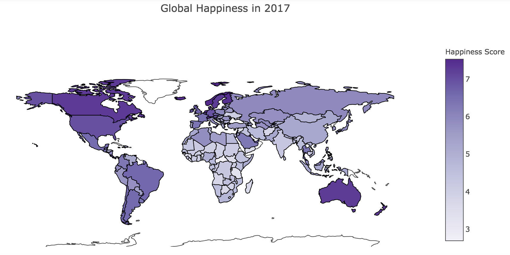

.. Happy Report Analysis documentation master file, created by
   sphinx-quickstart on Tue Nov 13 11:45:08 2018.
   You can adapt this file completely to your liking, but it should at least
   contain the root `toctree` directive.

Happiness Report Analysis
=================================================

.. toctree::
   :maxdepth: 2
   :caption: Contents:

Indices and tables
==================

* :ref:`genindex`
* :ref:`modindex`
* :ref:`search`

The following data is from the Happiness Report data from 2015, 2016, and 2017. Each of the datasets contain the country, their happiness score, and their happiness rate. Also, it shows the scores of each of the different categories that make up the happiness score. These scores for the categories added together make up the happiness score. These categories are: Distopia Residual, Economy (GDP per Capita), Family, Freedom, Generosity, Health (Life Expectancy), and Trust (Government Corruption). 

The questions we would like to answer are what countries and regions are the happiest, and what factors make countires happy.

Cleaning the Data
-----------------
We obtained the Happiness Report data from 2015, 2016, and 2017. We wanted to combine the three datasets into one dataset. The columns in the 2017 data had to be changed in order to match the other two datasets. We also added a year column to each dataset so when we combined them we could be able to tell which year the data is from. We also needed to add a region column to the 2017 data using the other datasets because there was not a region column. 

Here is the code we used to create the region column:

.. code-block:: python

   h = happy15[['Country','Region']]
   countries = dict(h.values)
   happy17['Region'] = 'Region'
   for c in happy17.index:
       if happy17.at[c, 'Country'] in countries:
           happy17.at[c, 'Region'] = countries[happy17.at[c, 'Country']]
       else:
           happy17.at[c, 'Region'] = 'Unknown'

Now that all of the datasets had the same organization, we concatinated them into one dataframe using this code:

.. code-block:: python

   frames = [happy15, happy16, happy17]
   happy = pd.concat(frames)
   happy = happy.set_index(['Country'])
   happy = happy.reset_index()

General Information
-------------------

We first wanted to know more general information about the data, such as what countries are the happiest and how have the countries changed over the years.

The following plot shows the average happiness score in the world over 3 years. 

The following bar plot shows the number of country appearances in the top 5 happiest countries over 2015-2017.

The following bar plot shows the highest and lowest growth of percent change over 2015-2017 for each country.

The following plot shows the average happiness score in each region in the year 2017. It shows that Western Europe, North America, and Australia and New Zealand have the highest average happiness scores, while Sub-Saharan Africa and Sourhtern Asia have the lowest average happiness scores.

Categorical Exploration
-----------------------

Our next question in our analysis was which areas of happiness are most important in forming the happiness score.

The following line plot shows the happiness score for the happiest country in 2015, 2016, and 2017 and the distribution of the categories that make up the score. It shows that the distopia residual makes up the largest portion of the score, while generosity and trust make up the smallest portions of the score.

The following area plot shows the top 50 happiest countries in 2017 with their category distributions. There is relatively a pattern of what is typically the most important in creating the score, but there some variations.

Correlations
-------------

We then wanted to look for correlations between the different categories of the happiness score.

The following is a scatter plot showing Economy vs Health with size relating to the rank and color relating to the score. The larger the circle the worse the rank, and the lighter the circle the higher the score. This scatter plot shows a very high correlation between economy and health.

.. figure:: images/healthvseconomy.png

The following is a scatter plot showing Family vs Freedom with size relating to the rank and color relating to the score. This plot shows there is not as high of a correlation between Freedom and Family compared to Economy and Health.

The following plot shows the correlation between the different categories, total score, and rank. There is a high positive correlation between happiness score and almost every category, and there is a high negative correlation between happiness rank and almost every category, which is to be expected. Some other somewhat high correlations are economy and health, family and economy, and family and health.

.. figure:: images/correlation.png

Overall
---------
The following map shows the happiness score for countries on a map. I used code found on kaggle relating to this data set to assist in creating this map. The darker the country, the higher the happiness score. The map makes it easier to see that the happiest countries are in North America, Europe, and Australia/New Zealand, and the least happy countries are found in Africa and Southern Asia.

In order to interact with this graph, go to our jupiter notebooks linked above.

